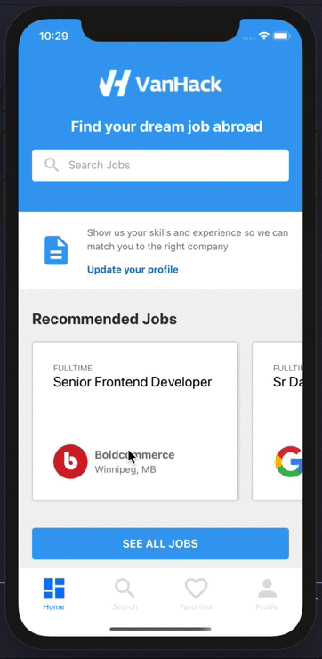

# VH - mobile

## Getting Started

This project was developed as a proposal for a mobile app. So this is just a proof of concept.

## How to test this implementation

### Prerequisites

In the project directory, you can run:

- `yarn`: Intalling dependencies
- `yarn react-native run-ios --simulator="iPhone 11"`: Start in development mode

> This app was only tested in iOS simulator - see task list below

## Project Structure

### Screens

This app shows a lot of screens and provides some functionalities to find a job, see some of them on these screens below

- Here you can find some interactions of some pages

 

<!--  -->

## Built With

- [React Native](https://reactnative.dev/) - A framework for building native apps using React
- [Styled Components](https://www.styled-components.com/) - Visual primitives for the component age. Use the best bits of ES6 and CSS to style your apps without stress
- [React Icons](https://react-icons.netlify.com/#/) - Popular icons in your React projects

## Contributing

Please read [CONTRIBUTING.md](https://gist.github.com/PurpleBooth/b24679402957c63ec426) for details on our code of conduct, and the process for submitting pull requests to us.

## Author

- **Marcio Mendes** - Initial work - [mmendesas](https://github.com/mmendesas)

See also the list of [contributors](https://github.com/mmendesas/vh_mobapp/contributors) who participated in this project.

## License

This project is licensed under the MIT License - see the [LICENSE.md](LICENSE.md) file for details

## Tasks To Do

- [ ] Remove mock server and access real api
- [ ] Make app avaiable for iOs and Android
- [ ] Add more content to profile page
- [ ] Add redux integration
- [ ] ...
